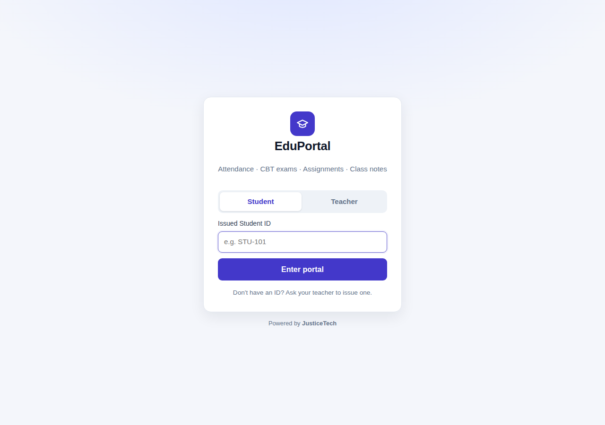
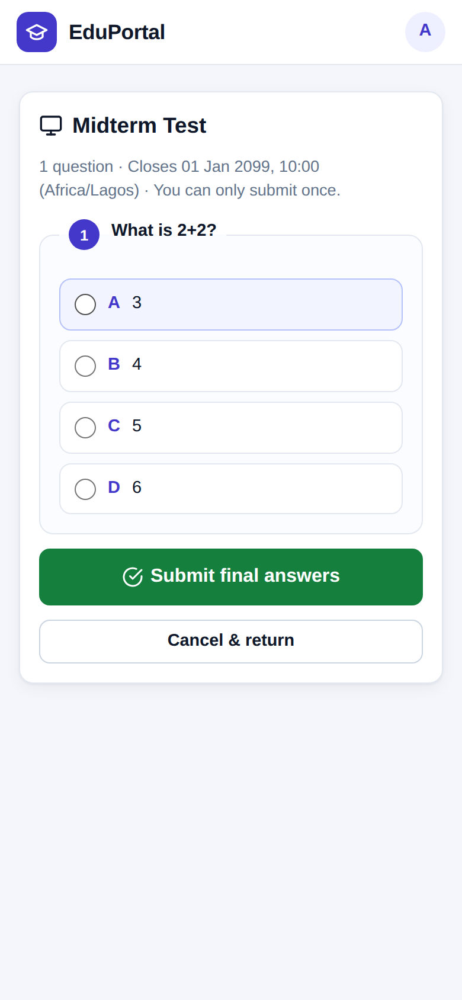
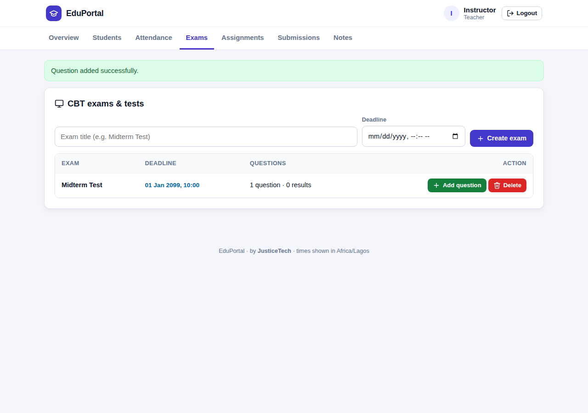

# 🎓 EduPortal

A lightweight classroom portal for teachers and students — **attendance, CBT exams, assignments, grading and class notes** in one place.

Built with Flask + SQLite. No external services, no CDN, no build step. It runs **locally on your Wi‑Fi / LAN**, or **hosted on the internet** for anyone with the link — from the same code.

<p align="center">
  
  
</p>
<p align="center"></p>

---

## Contents

- [Features](#features)
- [Important: GitHub Pages cannot run this app](#important-github-pages-cannot-run-this-app)
- [Run locally (Wi‑Fi / LAN)](#run-locally-wifi--lan)
- [Host it on the internet](#host-it-on-the-internet)
- [Configuration](#configuration)
- [Security notes](#security-notes)
- [Troubleshooting](#troubleshooting)
- [Project structure](#project-structure)

---

## Features

**Teacher**
- Issue and revoke authorized Student IDs
- Live attendance log (one record per student per day)
- Create CBT exams with multiple‑choice questions and deadlines; view every student's score
- Post assignments with attachments and deadlines; edit or delete them
- Grade submissions with feedback
- Upload class notes and resources

**Student**
- Log in with an issued ID (not case‑sensitive, phone‑friendly)
- Take timed‑deadline CBT exams (one attempt, instant score)
- Download assignments and notes, submit work before the deadline
- See grades and feedback

**Platform**
- Works fully **offline on a LAN** (no external fonts/scripts)
- Responsive UI — designed for phones as well as laptops
- CSRF protection, login throttling, safe uploads, role‑based access, strict CSP
- One timezone for all deadlines, regardless of where the server is

---

## Important: GitHub Pages cannot run this app

EduPortal is a **Python (Flask) application**. GitHub Pages only serves *static* files (HTML/CSS/JS) — it cannot execute Python, so it will show raw `` template tags and return **405 Method Not Allowed** on login.

Keep your code on GitHub, but **run** it either locally (below) or on a host that can run Python (see [Host it on the internet](#host-it-on-the-internet)).

---

## Run locally (Wi‑Fi / LAN)

Requires **Python 3.9+**.

```bash
# 1. Install dependencies (once)
python -m venv .venv
# Windows:  .venv\Scripts\activate        macOS/Linux:  source .venv/bin/activate
pip install -r requirements.txt

# 2. (Recommended) set your teacher password
cp .env.example .env        # then edit .env and set TEACHER_PASSWORD

# 3. Start
python app.py
```

The terminal prints the exact addresses to use:

```
Open on THIS computer:
   http://localhost:5000

Share with phones/laptops on the SAME Wi-Fi / LAN cable:
   http://192.168.1.23:5000   <-- give students this link
```

- Everyone must be on the **same network** (same Wi‑Fi, or connected by cable to the same router/switch).
- If port 5000 is busy (macOS uses it for AirPlay), the next free port is chosen automatically and printed.
- Options: `python app.py --port 8080` · `python app.py --local-only` (this computer only).
- Press **Ctrl+C** to stop.

> Without a `.env`, the teacher password falls back to `admin123` and the app warns you. **Change it before sharing.**

---

## Host it on the internet

Any host that runs a Python web process works. The app reads `PORT` from the environment and ships a `Procfile` (`gunicorn`) and a `render.yaml`.

### ⚠️ Read this first: data persistence

EduPortal stores data in a **SQLite file plus an uploads folder** (`DATA_DIR`, default `./data`). Many hosts give web apps a **temporary disk that is wiped on every deploy/restart** — your students, exams and uploads would disappear.

You must put `DATA_DIR` on **persistent storage** (a mounted disk/volume), or use a host with a permanent filesystem. Check your provider's current plans — persistent disks are often a paid feature.

### Option A — Render (uses `render.yaml`)

1. Push this project to GitHub.
2. In Render: **New → Blueprint**, select your repo.
3. When prompted, set `TEACHER_PASSWORD` and `PORTAL_TIMEZONE` (e.g. `Africa/Lagos`).
4. Attach a **persistent disk** to the service (e.g. mount path `/var/data`) and add the env var `DATA_DIR=/var/data`.
5. Open the URL Render gives you.

### Option B — PythonAnywhere (permanent filesystem)

1. Upload the project (or `git clone` it) in a Bash console and run `pip install --user -r requirements.txt`.
2. **Web** tab → *Add a new web app* → *Manual configuration* (Python 3.9+).
3. In the WSGI file, point to the app and set your variables:
   ```python
   import os, sys
   sys.path.insert(0, "/home/YOURNAME/eduportal")
   os.environ["TEACHER_PASSWORD"] = "choose-a-strong-password"
   os.environ["PORTAL_TIMEZONE"] = "Africa/Lagos"
   os.environ["TRUST_PROXY"] = "1"
   os.environ["COOKIE_SECURE"] = "1"
   from app import app as application
   ```
4. Reload the web app.

### Option C — Any VPS / Railway / Fly.io

Run `gunicorn app:app --workers 1 --threads 8 --bind 0.0.0.0:$PORT`, mount a persistent volume, and set the environment variables below. Put it behind HTTPS (most platforms do this for you) and set `TRUST_PROXY=1` and `COOKIE_SECURE=1`.

> **Keep `--workers 1`.** SQLite handles concurrent readers well but is not designed for many parallel writer processes; one worker with several threads is the right setup for a classroom.

---

## Configuration

Set as environment variables (or in a local `.env` file — see `.env.example`).

| Variable | Default | Purpose |
|---|---|---|
| `TEACHER_PASSWORD` | `admin123` (warns) | Teacher login password. **Always set this.** |
| `SECRET_KEY` | auto‑generated & saved | Signs login sessions. Set a fixed value on hosts with temporary disks. |
| `PORTAL_TIMEZONE` | server local time | IANA name, e.g. `Africa/Lagos`. Used for deadlines and attendance. **Set this when hosted** (servers are usually UTC). |
| `DATA_DIR` | `./data` | Where `classroom.db` and `uploads/` live. Point at persistent storage when hosted. |
| `PORT` | `5000` (auto if busy) | Port to listen on. Hosts set this for you. |
| `MAX_UPLOAD_MB` | `25` | Upload size limit. |
| `TRUST_PROXY` | off | Set `1` behind a reverse proxy/HTTPS terminator. |
| `COOKIE_SECURE` | off | Set `1` when served over HTTPS. |

**Upgrading from the older version?** Place your old `classroom.db` and `uploads/` next to `app.py` and start the app once — they are copied into `data/` automatically.

---

## Security notes

- Teacher password and secret key come from the environment — nothing sensitive is hard‑coded or committed (`.gitignore` excludes `data/`, `.env` and databases).
- All state‑changing actions are `POST` with a CSRF token; destructive actions ask for confirmation.
- Repeated failed logins from one address are temporarily blocked.
- Uploads are restricted to an allow‑list of file types, renamed safely, and always downloaded as attachments. Students can only download their **own** submissions.
- **Student IDs are the only student credential.** That is fine for a classroom LAN. On the open internet, anyone who guesses or is given an ID can sign in as that student — use hard‑to‑guess IDs (e.g. `STU-7Q4K-2291`) for hosted deployments.
- Serve hosted deployments over **HTTPS**.

---

## Troubleshooting

**Other devices can't open the LAN link**
- Confirm both devices are on the same Wi‑Fi/router. Guest Wi‑Fi and some school/public networks enable *client isolation*, which blocks device‑to‑device traffic.
- **Windows:** when prompted by Windows Defender Firewall, allow Python on **Private networks**. Otherwise: *Windows Security → Firewall → Allow an app* → enable Python.
- **macOS:** allow incoming connections for Python when prompted.
- **Linux:** `sudo ufw allow 5000/tcp` (or your chosen port).
- Use the **network** address printed in the terminal, not `localhost` (which only means "this device").
- Several adapters (Wi‑Fi + Ethernet + VPN)? Extra addresses are listed — try the one on your classroom network.

**"Port already in use"** — you passed `--port` for a busy port. Omit it to auto‑select, or choose another.

**Deadlines look wrong on a hosted server** — set `PORTAL_TIMEZONE`.

**Data disappeared after a redeploy** — your host uses a temporary disk. See [data persistence](#️-read-this-first-data-persistence).

---

## Project structure

```
eduportal/
├── app.py              # Flask app + local/LAN launcher
├── templates/          # Jinja templates (login, dashboard, exam, error)
├── static/             # CSS, JS, favicon (fully self-hosted)
├── requirements.txt
├── Procfile            # gunicorn start command for hosts
├── render.yaml         # one-click Render blueprint
├── .env.example        # configuration template
├── docs/               # screenshots
└── data/               # created at runtime: classroom.db + uploads/ (git-ignored)
```

---

<p align="center">Built by <strong>JusticeTech</strong></p>
